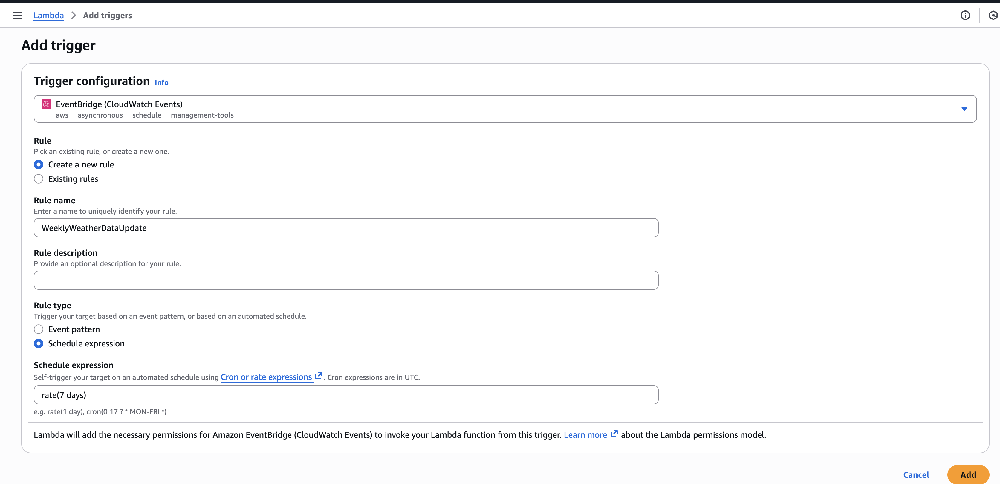
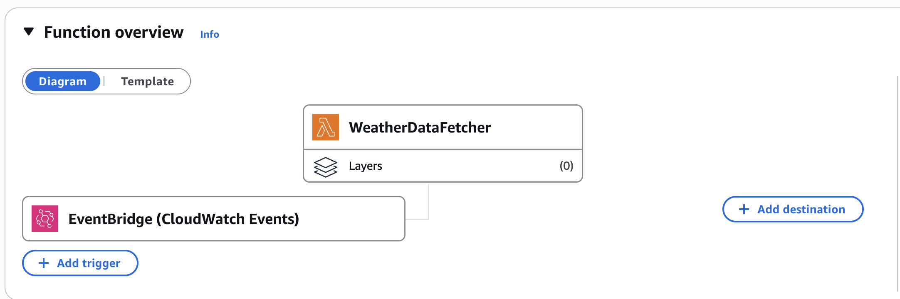

# Author: Arlan Amangeldin

# Neptun: SGMXRQ

# Hotel Bookings and Weather Analysis

### Business Case

- Hotels lose revenue from cancellations
- Weather significantly influences guest booking behavior
- Provide insights for dynamic pricing based on weather forecasts
- Optimize overbooking strategies to reduce revenue loss

### Target Stakeholders

- Hotel Revenue Manager
- General Manager
- Operations Director
- Marketing Director
### KPI:
- Weather impact on cancellation rate and revenue
- Lead time against cancellation risk
- Guest composition and weather preference
- Seasonal performance with weather patterns
### Project Overview

This project combines hotel booking data from Kaggle with historical weather data from Open-Meteo API using AWS services to analyze the impact of weather conditions on hotel cancellations and revenue.
It lets stakeholders run queries on booking and weather data together, so they can spot patterns and make decisions on pricing, staffing, and marketing based on weather forecasts.

## **Step 1: Create S3 Bucket**

1. Create bucket itself
   
2. Create folders within bucket for structure
   

## **Step 2: Download Hotel Bookings Data**


## **Step 3: Create Lambda Function to fetch weather data:**


```
import json
import boto3
import urllib3
from datetime import datetime

s3_client = boto3.client('s3')
http = urllib3.PoolManager()

def lambda_handler(event, context):

    BUCKET_NAME = 'hotel-weather-analysis-sgmxrq'
    S3_KEY = 'raw-data/weather/weather_data.csv'

    # Hotel locations in Portugal
    locations = {
        'Resort Hotel': {
            'lat': 37.0194,
            'lon': -7.9304,
            'name': 'Algarve'
        },
        'City Hotel': {
            'lat': 38.7223,
            'lon': -9.1393,
            'name': 'Lisbon'
        }
    }

    # Date range matching hotel bookings dataset
    start_date = '2015-07-01'
    end_date = '2017-08-31'

    all_weather_records = []

    # Fetch weather data for each location
    for hotel_type, location in locations.items():

        # Open-Meteo API request
        url = (
            "https://archive-api.open-meteo.com/v1/archive"
            "?latitude=" + str(location['lat']) +
            "&longitude=" + str(location['lon']) +
            "&start_date=" + start_date +
            "&end_date=" + end_date +
            "&daily=temperature_2m_max,temperature_2m_min,temperature_2m_mean," +
            "precipitation_sum,rain_sum,snowfall_sum,precipitation_hours," +
            "wind_speed_10m_max,wind_gusts_10m_max,wind_direction_10m_dominant," +
            "shortwave_radiation_sum,sunshine_duration" +
            "&timezone=Europe/Lisbon"
        )

        try:
            response = http.request('GET', url)

            if response.status == 200:
                data = json.loads(response.data.decode('utf-8'))
                daily_data = data.get('daily', {})

                # Extract weather metrics
                dates = daily_data.get('time', [])
                temp_max = daily_data.get('temperature_2m_max', [])
                temp_min = daily_data.get('temperature_2m_min', [])
                temp_mean = daily_data.get('temperature_2m_mean', [])
                precip = daily_data.get('precipitation_sum', [])
                rain = daily_data.get('rain_sum', [])
                snow = daily_data.get('snowfall_sum', [])
                precip_hrs = daily_data.get('precipitation_hours', [])
                wind_max = daily_data.get('wind_speed_10m_max', [])
                wind_gust = daily_data.get('wind_gusts_10m_max', [])
                wind_dir = daily_data.get('wind_direction_10m_dominant', [])
                radiation = daily_data.get('shortwave_radiation_sum', [])
                sunshine = daily_data.get('sunshine_duration', [])

                # Create records
                for i in range(len(dates)):
                    record = {
                        'date': dates[i],
                        'hotel': hotel_type,
                        'location': location['name'],
                        'temperature_2m_max': temp_max[i],
                        'temperature_2m_min': temp_min[i],
                        'temperature_2m_mean': temp_mean[i],
                        'precipitation_sum': precip[i],
                        'rain_sum': rain[i],
                        'snowfall_sum': snow[i],
                        'precipitation_hours': precip_hrs[i],
                        'wind_speed_10m_max': wind_max[i],
                        'wind_gusts_10m_max': wind_gust[i],
                        'wind_direction_10m_dominant': wind_dir[i],
                        'shortwave_radiation_sum': radiation[i],
                        'sunshine_duration': sunshine[i]
                    }
                    all_weather_records.append(record)

            else:
                return {
                    'statusCode': response.status,
                    'body': json.dumps('API request failed for ' + hotel_type)
                }

        except Exception as e:
            return {
                'statusCode': 500,
                'body': json.dumps('Exception occurred: ' + str(e))
            }

    # Convert to CSV
    if all_weather_records:
        headers = list(all_weather_records[0].keys())
        csv_content = ','.join(headers) + '\n'

        for record in all_weather_records:
            row = ','.join(str(record[h]) for h in headers)
            csv_content += row + '\n'

        # Upload to S3
        try:
            s3_client.put_object(
                Bucket=BUCKET_NAME,
                Key=S3_KEY,
                Body=csv_content.encode('utf-8'),
                ContentType='text/csv'
            )

            return {
                'statusCode': 200,
                'body': json.dumps({
                    'message': 'Weather data successfully fetched and stored',
                    'records_count': len(all_weather_records),
                    's3_location': 's3://' + BUCKET_NAME + '/' + S3_KEY,
                    'timestamp': datetime.utcnow().isoformat()
                })
            }

        except Exception as e:
            return {
                'statusCode': 500,
                'body': json.dumps('S3 upload failed: ' + str(e))
            }

    return {
        'statusCode': 400,
        'body': json.dumps('No weather data retrieved from API')
    }
```

reference: Claude Sonnet 4.5 helped with S3 load syntax


## **Step 4: Create EventBridge Rule for Weekly Execution:**




## **Step 5: Create Glue Database:**


## **Step 6: Create Glue Crawlers:**


## **Step 7: Create ETL job to combine data from both sources and crawler to catalogue it**


```
SELECT
    *,
    CAST(CONCAT(
        CAST(arrival_date_year AS STRING), '-',
        LPAD(CAST(CASE arrival_date_month
            WHEN 'January' THEN 1
            WHEN 'February' THEN 2
            WHEN 'March' THEN 3
            WHEN 'April' THEN 4
            WHEN 'May' THEN 5
            WHEN 'June' THEN 6
            WHEN 'July' THEN 7
            WHEN 'August' THEN 8
            WHEN 'September' THEN 9
            WHEN 'October' THEN 10
            WHEN 'November' THEN 11
            WHEN 'December' THEN 12
        END AS STRING), 2, '0'), '-',
        LPAD(CAST(arrival_date_day_of_month AS STRING), 2, '0')
    ) AS DATE) as arrival_date,
    (stays_in_weekend_nights + stays_in_week_nights) as total_nights,
    (adr * (stays_in_weekend_nights + stays_in_week_nights)) as total_revenue
FROM bookings
```

### _(SQL query used within ETL to get arrival date in correct format and total nights with revenues)_

```
SELECT
    hotel,
    is_canceled,
    lead_time,
    arrival_date_year,
    arrival_date_month,
    arrival_date_day_of_month,
    stays_in_weekend_nights,
    stays_in_week_nights,
    adults,
    children.long AS children,
    babies,
    meal,
    country,
    market_segment,
    distribution_channel,
    is_repeated_guest,
    previous_cancellations,
    previous_bookings_not_canceled,
    reserved_room_type,
    assigned_room_type,
    booking_changes,
    deposit_type,
    agent.long AS agent,
    company.string AS company,
    days_in_waiting_list,
    customer_type,
    adr,
    required_car_parking_spaces,
    total_of_special_requests,
    reservation_status,
    reservation_status_date,
    weather_date,
    weather_hotel,
    weather_location,
    weather_temperature_2m_max,
    weather_temperature_2m_min,
    weather_temperature_2m_mean,
    weather_precipitation_sum,
    weather_rain_sum,
    weather_snowfall_sum,
    weather_precipitation_hours,
    weather_wind_speed_10m_max,
    weather_wind_gusts_10m_max,
    weather_wind_direction_10m_dominant,
    weather_shortwave_radiation_sum,
    weather_sunshine_duration
FROM myDataSource
```

### _(SQL query used within ETL to flatten out the struct objects)_


## **Step 8: Data Analysis using AWS Athena**

### **Query 1:**

```
SELECT hotel,
    CASE
        WHEN weather_temperature_2m_mean < 15 THEN 'Cold (<15°C)'
        WHEN weather_temperature_2m_mean BETWEEN 15 AND 25 THEN 'Moderate (15-25°C)'
        ELSE 'Warm (>25°C)'
    END AS temp_category,
    COUNT(*) AS total_bookings,
    SUM(is_canceled) AS cancellations,
    ROUND(100.0 * SUM(is_canceled) / COUNT(*), 2) AS cancellation_rate
FROM combined
WHERE weather_temperature_2m_mean IS NOT NULL
GROUP BY 1,2
ORDER BY 1;
```

### Output:

| hotel        | temp_category      | total_bookings | cancellations | cancellation_rate |
| ------------ | ------------------ | -------------- | ------------- | ----------------- |
| City Hotel   | Moderate (15-25°C) | 51780          | 22241         | 42.95             |
| City Hotel   | Cold (<15°C)       | 24572          | 9781          | 39.81             |
| Resort Hotel | Moderate (15-25°C) | 25547          | 7283          | 28.51             |
| Resort Hotel | Warm (>25°C)       | 5711           | 1970          | 34.49             |
| Resort Hotel | Cold (<15°C)       | 8802           | 1869          | 21.23             |
| City Hotel   | Warm (>25°C)       | 2978           | 1080          | 36.27             |

## City Hotel cancels more no matter the temperature (36-43%), but Resort Hotel is different — cold weather actually has the lowest cancellations (21%) which is kind of unexpected for a beach resort. Warm weather goes up to 34%.

### **Query 2:**

```
SELECT
    hotel,
    arrival_date_month AS month,
    COUNT(*) AS bookings,
    ROUND(AVG(weather_temperature_2m_mean), 1) AS avg_temp_celsius,
    ROUND(AVG(weather_precipitation_sum), 1) AS avg_rain_mm,
    ROUND(100.0 * SUM(is_canceled) / COUNT(*), 2) AS cancel_rate,
    ROUND(AVG(adr), 2) AS avg_rate,
    SUM(CASE WHEN is_canceled = 0 THEN adr ELSE 0 END) AS total_revenue
FROM combined
WHERE adr > 0 AND weather_temperature_2m_mean IS NOT NULL
GROUP BY hotel, arrival_date_month
ORDER BY
    hotel,
    CASE arrival_date_month
        WHEN 'January' THEN 1 WHEN 'February' THEN 2 WHEN 'March' THEN 3
        WHEN 'April' THEN 4 WHEN 'May' THEN 5 WHEN 'June' THEN 6
        WHEN 'July' THEN 7 WHEN 'August' THEN 8 WHEN 'September' THEN 9
        WHEN 'October' THEN 10 WHEN 'November' THEN 11 WHEN 'December' THEN 12
    END;
```

### Output:

| hotel        | month     | bookings | avg_temp_celsius | avg_rain_mm | cancel_rate | avg_rate | total_revenue |
| ------------ | --------- | -------- | ---------------- | ----------- | ----------- | -------- | ------------- |
| City Hotel   | January   | 3671     | 11.4             | 2.6         | 40.21       | 84.09    | 185190.07     |
| City Hotel   | February  | 4875     | 12.1             | 2.5         | 38.69       | 86.66    | 264064.79     |
| City Hotel   | March     | 6369     | 12.8             | 1.6         | 37.37       | 93.94    | 367175.18     |
| City Hotel   | April     | 7406     | 15.6             | 1.1         | 46.58       | 112.36   | 449105.15     |
| City Hotel   | May       | 8121     | 17.5             | 3.5         | 44.86       | 123.3    | 551521.51     |
| City Hotel   | June      | 7816     | 20.8             | 0.1         | 45.05       | 120.26   | 513887.26     |
| City Hotel   | July      | 7979     | 22.2             | 0.1         | 41.27       | 112.25   | 552626.14     |
| City Hotel   | August    | 8862     | 22.4             | 0.0         | 40.53       | 116.25   | 637175.42     |
| City Hotel   | September | 7282     | 20.5             | 0.4         | 42.57       | 111.79   | 483047.36     |
| City Hotel   | October   | 7467     | 18.4             | 2.5         | 43.51       | 101.82   | 441272.21     |
| City Hotel   | November  | 4266     | 14.9             | 2.3         | 38.75       | 89.95    | 233205.23     |
| City Hotel   | December  | 4008     | 13.1             | 1.6         | 43.16       | 91.57    | 210153.38     |
| Resort Hotel | January   | 2130     | 12.7             | 1.7         | 14.98       | 50.92    | 90988.26      |
| Resort Hotel | February  | 3046     | 13.5             | 2.3         | 25.94       | 56.2     | 124972.38     |
| Resort Hotel | March     | 3272     | 14.0             | 1.1         | 23.14       | 58.65    | 146699.51     |
| Resort Hotel | April     | 3547     | 16.6             | 1.0         | 29.72       | 79.21    | 193462.93     |
| Resort Hotel | May       | 3490     | 18.6             | 2.4         | 29.11       | 80.32    | 194326.91     |
| Resort Hotel | June      | 3003     | 23.2             | 0.0         | 33.37       | 111.99   | 219944.77     |
| Resort Hotel | July      | 4512     | 25.0             | 0.0         | 31.69       | 157.28   | 470934.37     |
| Resort Hotel | August    | 4849     | 24.9             | 0.0         | 33.74       | 188.52   | 590187.59     |
| Resort Hotel | September | 3069     | 22.1             | 0.1         | 32.32       | 94.44    | 202668.24     |
| Resort Hotel | October   | 3462     | 19.7             | 3.5         | 27.73       | 63.77    | 159071.78     |
| Resort Hotel | November  | 2375     | 16.5             | 1.7         | 19.24       | 49.53    | 96194.92      |
| Resort Hotel | December  | 2553     | 15.3             | 2.3         | 24.48       | 71.55    | 137805.95     |

### Resort Hotel makes the most money in July-August when it's hot (24-25°C) and no rain — ADR goes up to $157-188. City Hotel is more steady throughout the year. Makes sense that summer = higher prices.

### **Query 3:**

```
SELECT hotel,
    CASE
        WHEN lead_time <= 7 THEN 'Last Minute (0-7 days)'
        WHEN lead_time BETWEEN 8 AND 30 THEN 'Short Notice (8-30 days)'
        WHEN lead_time BETWEEN 31 AND 90 THEN 'Advance (1-3 months)'
        ELSE 'Early Bird (3+ months)'
    END AS booking_window,
    COUNT(*) AS bookings,
    ROUND(100.0 * SUM(is_canceled) / COUNT(*), 2) AS cancel_rate_pct,
    ROUND(AVG(adr), 2) AS avg_daily_rate,
    SUM(CASE WHEN is_canceled = 0 THEN adr ELSE 0 END) AS realized_revenue
FROM combined
WHERE adr > 0
GROUP BY 1,2
ORDER BY bookings DESC;
```

### Output:

| hotel        | booking_window           | bookings | cancel_rate_pct | avg_daily_rate | realized_revenue |
| ------------ | ------------------------ | -------- | --------------- | -------------- | ---------------- |
| City Hotel   | Early Bird (3+ months)   | 35048    | 55.87           | 102.7          | 1649171.95       |
| City Hotel   | Advance (1-3 months)     | 20662    | 40.08           | 108.02         | 1312004.04       |
| Resort Hotel | Early Bird (3+ months)   | 15816    | 39.62           | 100.03         | 930841.00        |
| City Hotel   | Short Notice (8-30 days) | 12393    | 31.21           | 114.65         | 961579.27        |
| City Hotel   | Last Minute (0-7 days)   | 10019    | 12.41           | 109.94         | 965668.44        |
| Resort Hotel | Advance (1-3 months)     | 8645     | 32.75           | 106.14         | 600854.87        |
| Resort Hotel | Last Minute (0-7 days)   | 8589     | 6.52            | 78.6           | 626846.17        |
| Resort Hotel | Short Notice (8-30 days) | 6258     | 22.05           | 100.53         | 468715.57        |

### Basically the earlier people book, the more likely they cancel. Early bird bookings at City Hotel have 55.87% cancellation vs only 12.41% for last minute. So last minute bookers actually show up.

### **Query 4:**

```
SELECT
    hotel,
    CASE
        WHEN weather_wind_speed_10m_max < 20 THEN 'Calm (<20 km/h)'
        WHEN weather_wind_speed_10m_max BETWEEN 20 AND 40 THEN 'Moderate (20-40 km/h)'
        ELSE 'Strong (>40 km/h)'
    END AS wind_level,
    COUNT(*) AS bookings,
    ROUND(AVG(weather_wind_speed_10m_max), 1) AS avg_wind_speed,
    ROUND(100.0 * SUM(is_canceled) / COUNT(*), 2) AS cancel_rate,
    ROUND(AVG(adr), 2) AS avg_rate
FROM combined
WHERE weather_wind_speed_10m_max IS NOT NULL AND adr > 0
GROUP BY 1,2
ORDER BY hotel, cancel_rate DESC;
```

### Output:

| hotel        | wind_level            | bookings | avg_wind_speed | cancel_rate | avg_rate |
| ------------ | --------------------- | -------- | -------------- | ----------- | -------- |
| City Hotel   | Strong (>40 km/h)     | 955      | 43.6           | 43.14       | 81.03    |
| City Hotel   | Calm (<20 km/h)       | 30270    | 16.1           | 42.41       | 106.82   |
| City Hotel   | Moderate (20-40 km/h) | 46897    | 26.2           | 42.06       | 107.54   |
| Resort Hotel | Moderate (20-40 km/h) | 27408    | 27.5           | 28.22       | 100.28   |
| Resort Hotel | Calm (<20 km/h)       | 10473    | 15.9           | 27.81       | 92.05    |
| Resort Hotel | Strong (>40 km/h)     | 1427     | 44.7           | 27.4        | 63.93    |

### Wind doesn't change cancellations much but it kills the Resort Hotel's prices — drops from ~$100 to $64 when it's windy. City Hotel prices also drop but not as bad. Wind is more of a problem for the resort.

### **Query 5:**

```
SELECT
    hotel,
    CASE
        WHEN weather_precipitation_sum = 0 THEN 'Dry (0mm)'
        WHEN weather_precipitation_sum > 0 AND weather_precipitation_sum <= 5 THEN 'Light Rain (0-5mm)'
        WHEN weather_precipitation_sum > 5 AND weather_precipitation_sum <= 15 THEN 'Moderate Rain (5-15mm)'
        ELSE 'Heavy Rain (>15mm)'
    END AS rain_category,
    COUNT(*) AS bookings,
    ROUND(AVG(weather_precipitation_sum), 1) AS avg_precipitation,
    ROUND(100.0 * SUM(is_canceled) / COUNT(*), 2) AS cancel_rate,
    ROUND(AVG(adr), 2) AS avg_rate,
    SUM(CASE WHEN is_canceled = 0 THEN adr ELSE 0 END) AS revenue
FROM combined
WHERE weather_precipitation_sum IS NOT NULL AND adr > 0
GROUP BY 1,2
ORDER BY hotel, revenue DESC;
```

### Output:

| hotel        | rain_category          | bookings | avg_precipitation | cancel_rate | avg_rate | revenue    |
| ------------ | ---------------------- | -------- | ----------------- | ----------- | -------- | ---------- |
| City Hotel   | Dry (0mm)              | 54097    | 0.0               | 42.11       | 109.62   | 3474726.30 |
| City Hotel   | Light Rain (0-5mm)     | 16185    | 1.2               | 42.37       | 102.07   | 965201.04  |
| City Hotel   | Moderate Rain (5-15mm) | 6173     | 8.4               | 44.45       | 95.47    | 331140.01  |
| City Hotel   | Heavy Rain (>15mm)     | 1667     | 22.1              | 35.39       | 109.44   | 117356.35  |
| Resort Hotel | Dry (0mm)              | 30555    | 0.0               | 28.25       | 104.71   | 2198198.33 |
| Resort Hotel | Light Rain (0-5mm)     | 5884     | 1.3               | 27.06       | 71.53    | 298406.82  |
| Resort Hotel | Moderate Rain (5-15mm) | 1771     | 8.5               | 30.77       | 63.66    | 77257.37   |
| Resort Hotel | Heavy Rain (>15mm)     | 1098     | 23.5              | 24.59       | 64.59    | 53395.09   |

### Weird finding here — heavy rain actually has LOWER cancellation rates (35% vs 42% for City, 25% vs 28% for Resort). Maybe people who book when rain is forecasted are more serious about coming? Not sure but interesting.

### **Query 6:**

```
SELECT
    hotel,
    CASE
        WHEN weather_sunshine_duration / 3600 >= 10 THEN 'Very Sunny (10+ hrs)'
        WHEN weather_sunshine_duration / 3600 BETWEEN 6 AND 10 THEN 'Sunny (6-10 hrs)'
        WHEN weather_sunshine_duration / 3600 BETWEEN 3 AND 6 THEN 'Partly Cloudy (3-6 hrs)'
        ELSE 'Cloudy (<3 hrs)'
    END AS sunshine_level,
    COUNT(*) AS bookings,
    ROUND(AVG(weather_sunshine_duration / 3600), 1) AS avg_sunshine_hrs,
    ROUND(100.0 * SUM(is_canceled) / COUNT(*), 2) AS cancel_rate,
    ROUND(AVG(adr), 2) AS avg_rate
FROM combined
WHERE weather_sunshine_duration IS NOT NULL AND adr > 0
GROUP BY 1,2
ORDER BY hotel, avg_rate DESC;
```

### Output:

| hotel        | sunshine_level          | bookings | avg_sunshine_hrs | cancel_rate | avg_rate |
| ------------ | ----------------------- | -------- | ---------------- | ----------- | -------- |
| City Hotel   | Very Sunny (10+ hrs)    | 52201    | 12.2             | 42.49       | 113.88   |
| City Hotel   | Cloudy (<3 hrs)         | 1970     | 0.9              | 40.1        | 95.59    |
| City Hotel   | Sunny (6-10 hrs)        | 19474    | 8.6              | 39.83       | 93.47    |
| City Hotel   | Partly Cloudy (3-6 hrs) | 4477     | 4.7              | 50.19       | 89.5     |
| Resort Hotel | Very Sunny (10+ hrs)    | 26767    | 12.1             | 30.44       | 113.44   |
| Resort Hotel | Cloudy (<3 hrs)         | 775      | 0.9              | 22.45       | 65.08    |
| Resort Hotel | Sunny (6-10 hrs)        | 10588    | 8.7              | 22.36       | 61.3     |
| Resort Hotel | Partly Cloudy (3-6 hrs) | 1178     | 4.3              | 29.46       | 57.67    |

### Sunny days = higher prices. Very sunny days have the highest ADR for both hotels. Could use weather forecasts to adjust pricing.

### **Query 7:**

```
SELECT
    hotel,
    CASE
        WHEN adults = 1 AND children = 0 AND babies = 0 THEN 'Solo Traveler'
        WHEN adults = 2 AND children = 0 AND babies = 0 THEN 'Couple'
        WHEN adults >= 1 AND (children > 0 OR babies > 0) THEN 'Family'
        WHEN adults > 2 AND children = 0 AND babies = 0 THEN 'Group'
        ELSE 'Other'
    END AS guest_type,
    COUNT(*) AS bookings,
    ROUND(100.0 * COUNT(*) / SUM(COUNT(*)) OVER(PARTITION BY hotel), 2) AS pct_of_hotel_bookings,
    ROUND(100.0 * SUM(is_canceled) / COUNT(*), 2) AS cancel_rate,
    ROUND(AVG(adr), 2) AS avg_rate,
    ROUND(AVG(stays_in_week_nights + stays_in_weekend_nights), 1) AS avg_stay_length,
    ROUND(AVG(weather_temperature_2m_mean), 1) AS avg_temp_celsius,
    ROUND(AVG(weather_precipitation_sum), 1) AS avg_precipitation_mm,
    ROUND(AVG(weather_sunshine_duration / 3600), 1) AS avg_sunshine_hrs,
    SUM(CASE WHEN is_canceled = 0 THEN adr ELSE 0 END) AS total_revenue
FROM combined
WHERE adr > 0 AND weather_temperature_2m_mean IS NOT NULL
GROUP BY 1,2
ORDER BY hotel, total_revenue DESC;
```

### Output:

| hotel        | guest_type    | bookings | pct_of_hotel_bookings | cancel_rate | avg_rate | avg_stay_length | avg_temp_celsius | avg_precipitation_mm | avg_sunshine_hrs | total_revenue |
| ------------ | ------------- | -------- | --------------------- | ----------- | -------- | --------------- | ---------------- | -------------------- | ---------------- | ------------- |
| City Hotel   | Couple        | 53111    | 67.98                 | 45.27       | 101.16   | 3.0             | 17.8             | 1.4                  | 10.6             | 3010655.49    |
| City Hotel   | Solo Traveler | 14982    | 19.18                 | 35.48       | 97.15    | 2.6             | 16.8             | 1.4                  | 10.2             | 917600.00     |
| City Hotel   | Family        | 5121     | 6.56                  | 34.64       | 154.26   | 3.4             | 18.4             | 1.1                  | 11.0             | 508727.69     |
| City Hotel   | Group         | 4657     | 5.96                  | 37.64       | 153.65   | 3.4             | 18.6             | 1.1                  | 11.2             | 438637.25     |
| City Hotel   | Other         | 251      | 0.32                  | 34.26       | 79.97    | 4.0             | 17.5             | 1.5                  | 10.1             | 12803.27      |
| Resort Hotel | Couple        | 27641    | 70.32                 | 30.02       | 94.86    | 4.6             | 19.4             | 1.3                  | 10.8             | 1802803.24    |
| Resort Hotel | Family        | 3884     | 9.88                  | 35.89       | 163.01   | 4.8             | 21.3             | 0.8                  | 11.5             | 384620.47     |
| Resort Hotel | Solo Traveler | 6739     | 17.14                 | 17.17       | 57.22    | 3.1             | 17.0             | 1.5                  | 10.0             | 308512.71     |
| Resort Hotel | Group         | 1043     | 2.65                  | 18.22       | 156.36   | 5.0             | 21.6             | 0.5                  | 11.6             | 131293.19     |
| Resort Hotel | Other         | 1        | 0.0                   | 0.0         | 28.0     | 10.0            | 13.9             | 0.0                  | 8.7              | 28.0          |

### Couples are most of the bookings (68-70%). Families and groups book when it's warmer and sunnier and they pay more per booking. Solo travelers at the Resort Hotel barely cancel (17%) which is good.
